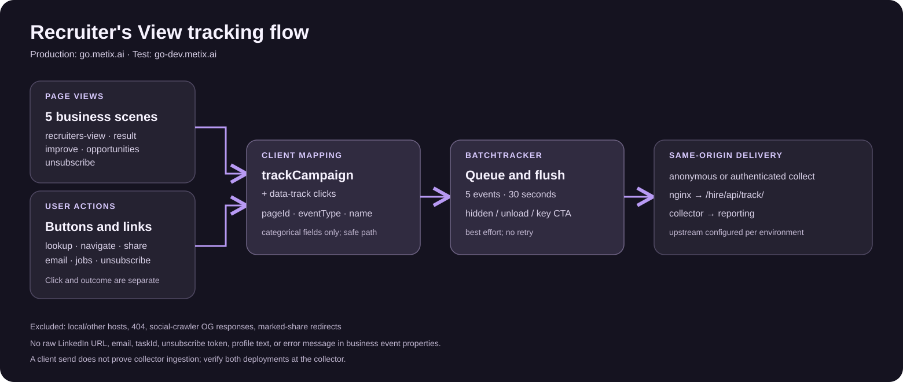

# Recruiter's View 埋点方案

生产站点为 `https://go.metix.ai`，测试站点为 `https://go-dev.metix.ai`，两者均采集。本站使用 `businessId=go-rank` 和 `campaign=rank`。`eventId` 与 `properties.event_name` 都采用三段式 `go-rank.页面名.事件名`；位置和模块另存字段。

## 1. 目标

- 看查询漏斗：打开页面、提交 LinkedIn、查到结果、失败原因。
- 看结果之后的动作：看结果、去改进、去职位、分享、下载卡片、移除档案。
- 看邮件表单与退订：提交、处理成功、失败分开计；本地保存不等于邮件送达。
- 业务埋点不传 LinkedIn 地址、邮箱、姓名、排名文案或错误原文；归因参数的边界见第 4 节。

## 2. 标识

埋点名统一为 `go-rank.页面名.事件名`，同时写入 `eventId` 和 `properties.event_name`。首页 `/recruiters-view/` 的页面名是 `recruiters-view`，例如查询开始为 `go-rank.recruiters-view.lookup-start`。事件名由原 `name` 和 `eventType` 拼出，以下划线分隔的词转成短横线；两者相同时只写一次，例如 `page_view` → `go-rank.recruiters-view.page-view`。

| 段 | 字段 | 本站取值 |
|---|---|---|
| 业务 | `businessId` | `go-rank` |
| 页面 | `pageId` | 见下表 |
| 位置 | `positionId` | 固定 `page`。区块放 `properties.location`；不拼入埋点名 |
| 动作 | 埋点名第 3 段 | 事件名，如 `share-click` |
| 完整埋点名 | `eventId`、`properties.event_name` | `go-rank.页面名.事件名`，如 `go-rank.result.share-click` |
| 类型 | `eventType` | `page_view` `show` `click` `start` `submit` `success` `error` |
| 模块 | `moduleId` | 可选，不进 `eventId` |

| 场景 | 路径 | 页面事件 | `pageId` |
|---|---|---|---|
| 入口 | `/recruiters-view/`，包括仅带 `linkedin_url` 的入口 | `page_view`，`scene=recruiters-view` | `recruiters-view` |
| 结果 | `/show/:taskId`、`/recruiters-view/result`、带 `task_id` / `taskId` / `u` 的入口 | `page_view`，`scene=result` | `result` |
| 分享中转 | 直接打开 `/share/:taskId` | 中转响应不发送 `page_view`；真人重定向后的首页会发送 `recruiters-view` PV | — |
| 改进 | `/recruiters-view/improve` | `page_view`，`scene=improve` | `improve` |
| 职位 | `/recruiters-view/opportunities` | `page_view`，`scene=opportunities` | `opportunities` |
| 退订 | `/unsubscribe`、`/recruiters-view/unsubscribe` | `page_view`，`scene=unsubscribe` | `unsubscribe` |

`/` 和旧 `/recruiters-view/share` 只重定向；nginx 部署下的 `/unsubcribe` 也重定向。在最终落地页记录 PV。404 不产生业务事件。首次加载由 SDK 记录，客户端切换场景由 React 记录；同一页面 ID 连续出现只记一次。`page_view` 表示进入页面场景，不表示排名已查到；查到结果另记 `result.show`。结果页在当前标签更新成 `/show/:taskId` 时不会额外触发首页 PV。

## 3. 页面与按钮清单

表中 `name.type` 表示事件的 `name` 和 `eventType`，例如结果页的 `share.click` 对应 `go-rank.result.share-click`；按钮点击发生在请求之前，结果事件只在代码收到相应结果后发送。禁用按钮不会产生点击事件。所有页面的导航 Logo、顶部 Check your ranking、页脚链接共用第 3.1 节。

### 3.1 全站导航

| 控件 | 点击事件 | 属性 / 说明 |
|---|---|---|
| Logo | `logo.click` | `location=nav` |
| 顶部 Check your ranking | `nav_link.click` | `location=recruiters-view-nav`、`label=check-ranking` |
| 页脚 Terms / Privacy | `outbound.click` | `location=footer`、`label=terms` / `privacy` |
| 页脚 support 邮箱 | `contact_email.click` | `location=footer` |

未标注的跨站 http(s) 链接会自动产生 `outbound.click`（`location=content`）。`metix.ai`、`www.metix.ai`、`go.metix.ai`、`go-dev.metix.ai` 之间不算跨站。外链 `target` 只保留 origin。X / LinkedIn 分享链接、外部职位卡片同时有各自业务点击事件和自动 `outbound.click`；Edit LinkedIn profile 使用显式点击埋点，因此不再自动产生 `outbound`。

### 3.2 入口、查询中、查询失败

| 页面 / 控件 | 点击事件 | 后续事件或说明 |
|---|---|---|
| 入口 See your ranking | `lookup_submit.click` | 合法 URL：`lookup.start`，`source=input`；非法 URL：`lookup.error`，`reason=invalid_input` |
| 查询动画 Cancel search | `cancel_search.click` | 中止请求；中止不记 `lookup.error` |
| 未收录或不可用页 Back to search | `return_to_search.click`，`location=not_found` / `unavailable` | 返回入口，随后首页 PV |

邮件或未标记分享链接进入会记 `lookup.start`，`source=link`。查到排名记 `lookup.success`，`result_type=found`；档案不存在或排名不可用（包括 `/peer-rank/rank` 返回业务码 `6306`）记 `lookup.error`，`result_type=not_found` / `unavailable`，展示带三条建议、无按钮的结果卡片。其他接口错误记 `result_type=invalid`，网络异常和超时记 `reason=service_error`；这些错误显示在入口输入框下。邮件链接查询失败时还可在错误下重试任务。本地输入格式无效也显示在输入框下，且没有 `lookup.start`。

### 3.3 排名结果与分享

| 控件 / 展示 | 事件 | 属性 / 说明 |
|---|---|---|
| 排名结果显示 | `result.show` | `mode=live` / `demo`；查到结果并实际显示时发送 |
| How is this calculated? | `calculation_details.click` | 展开或收起说明，`location=result` |
| Improve ranking | `navigate.click` | `destination=improve`，随后 `improve` PV |
| Explore opportunities | `navigate.click` | `destination=opportunities`，随后 `opportunities` PV |
| Share on X / LinkedIn | `share.click` | `channel=x` / `linkedin`；仅代表点击分享入口 |
| Copy link / Copied | `share_copy_attempt.click` | 复制与 LinkedIn 相同的分享文案，加上点击时当前页面的 URL；剪贴板写入成功后另记 `share.click`，`channel=copy`；失败仅有点击事件 |
| Download card | `card_download.click` | `format=png`；仅代表点击下载链接 |
| Retry download | `card_download_retry.click` | 仅图片生成失败且重试按钮可点击时发送 |
| Remove me | `remove_profile.click` | 请求成功或失败都会显示 toast，约 1.8 秒后返回入口；点击事件不代表服务端移除成功 |
| Check another profile | `return_to_search.click`，`location=result` | 返回入口，随后首页 PV |

卡片仍在 Preparing 状态时按钮禁用，无点击事件；复制失败、浏览器是否真正下载文件、社交平台是否发帖，目前都没有成功事件。

### 3.4 改进、职位

| 页面 / 控件 | 点击事件 | 后续事件或说明 |
|---|---|---|
| 改进：Back to ranking | `navigate.click`，`destination=result` | 返回结果页，随后 `result` PV |
| 改进：每条 checklist | `checklist_detail.click`，`item_index=1…3` | 展开或收起；不传建议文案 |
| 改进：Edit LinkedIn profile | `edit_profile.click` | `target` 只保留 LinkedIn origin |
| 改进：Get my updated ranking | `email_submit_click.click`，`source=ranking_update` | 有效邮箱后发送 `ranking_update.submit`；本地保存后 `success`，失败后 `error` |
| 职位：Back to ranking | `navigate.click`，`destination=result` | 返回结果页，随后 `result` PV |
| 职位：外部职位卡片 | `job.click`，`destination=external` | 点击外链，另有自动 `outbound.click`；不代表申请完成 |
| 职位：示例职位卡片 | `job.click`，`destination=details` | 打开示例详情弹窗 |
| 职位弹窗：Close | `job_details_close.click` | 仅关闭按钮；Esc 和点遮罩当前不记 |
| 职位：Send me the shortlist | `email_submit_click.click`，`source=job_shortlist` | 有效邮箱后发送 `job_shortlist.submit`；本地保存后 `success`，失败后 `error` |

两个邮件表单的 `success` 仅代表本地请求已保存，不代表邮件送达。邮箱格式校验失败仍有按钮点击事件，但没有 `submit` 业务事件。

### 3.5 退订

| 控件 | 点击事件 | 后续事件或说明 |
|---|---|---|
| Keep emails | `unsubscribe_keep.click` | 返回 `/recruiters-view/`，不调用退订接口 |
| Unsubscribe | `unsubscribe_submit_click.click` | token 有效才发送 `unsubscribe.submit`；接口成功后 `unsubscribe.success`，失败后 `unsubscribe.error` |
| 成功页 Back to home | `unsubscribe_home.click` | 返回 `/recruiters-view/` |

token 缺失时显示错误，只保留按钮点击事件，不发 `unsubscribe.submit`；错误内容与 token 都不传入事件。

### 3.6 明确不采集的控件

输入框逐字输入、动画进度、卡片悬停、浏览器返回、分享中转页的爬虫预览与真人重定向、404 页、动画调试页都不作为按钮事件。Skip to content 是无业务含义的无障碍跳转，不计点击。状态变化、页面 PV 与按钮点击是独立事件，不以一个替代另一个。

## 4. 属性

业务侧只允许这些键，字符串只能是 1–64 位字母、数字、下划线、连字符：

`scene` `source` `location` `method` `status` `reason` `result_type` `channel` `destination` `format` `revision` `rank_bucket` `role_count` `job_count` `has_result` `is_preview` `mode` `count`

上面是 `trackCampaign` 的白名单。声明式 `data-track-*` 由 SDK 读取，当前只填固定分类值及建议的序号 `item_index`；SDK 限制每项长度，但不执行这份业务白名单。新增声明式属性时必须保持分类值，不能放输入框内容或动态用户资料。

SDK 另外自动带上：`path`、`campaign=rank`、`scene`、`event_name`、`is_logged_in`、`visitor_id`，以及 14 天内的 UTM / 点击标识。没有归因时 `utm_source=direct`。调用方不能覆盖这些自动字段。`path` 不带查询参数：任务页记录 `/show/:taskId`，退订页记录 `/unsubscribe`。归因脚本按原值保留 UTM / 点击标识（最长 255 字符），这部分不经过上面的业务属性白名单；投放链接不得在这些参数里放个人信息。

业务事件属性不采集：LinkedIn URL、handle、邮箱、姓名、公司、职位原文、建议文案、错误原文、退订 token。

## 5. 口径

| 指标 | 计算 |
|---|---|
| 入口 PV | `page_view` 且 `scene=recruiters-view` |
| 手动查询提交率 | `lookup.start` 且 `source=input` / 入口 PV；邮件及分享 `source=link`、重试 `source=retry` 单独统计 |
| 查询成功率 | `lookup.success` / `lookup.start` |
| 失败分布 | `lookup.error` 按 `reason` 或 `result_type` |
| 结果查看 | `result.show` |
| 改进 / 职位到达 | `navigate.click` 按 `destination` |
| 分享入口点击率 | `share.click` / `result.show`；不能当作实际发布率 |
| 复制成功率 | `share.click` 且 `channel=copy` / `share_copy_attempt.click` |
| 邮件表单提交率 | 对应 `submit` / 所在页 PV |
| 邮件表单有效提交率 | 对应 `submit` / `email_submit_click.click`，按 `source` 分组 |
| 邮件表单处理成功率 | 对应 `success` / `submit`；本地表单不能当作送达率 |
| 退订确认率 | `unsubscribe.success` / `unsubscribe.submit` |
